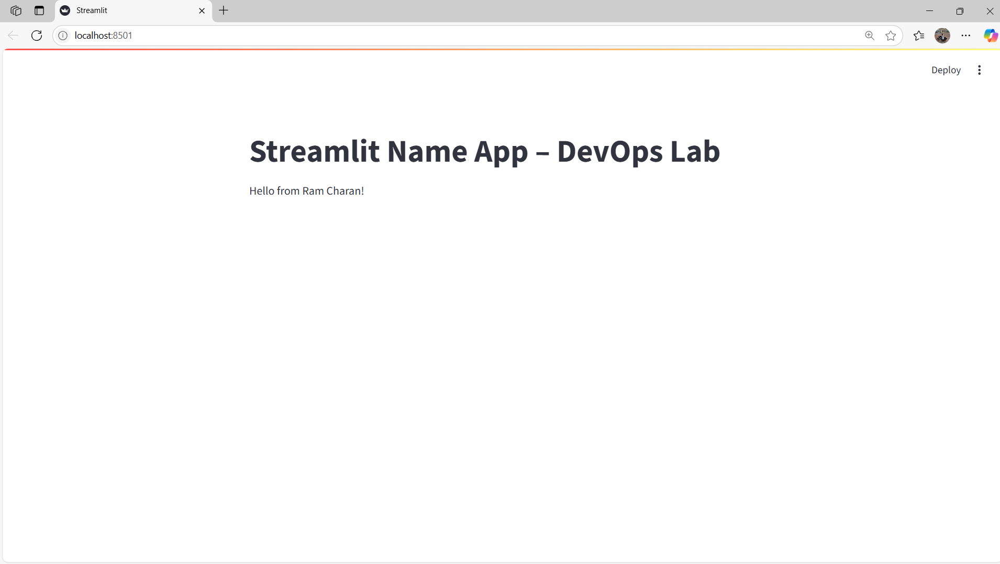

This is the DevOps project created by Ramcharan-24955A0528 ,Ranga Bharadwaj-23951A057E and Ravindra-23951A057H.

## Overview

This project demonstrates simple DevOps practices including Python scripting and version control.

## How to run


Run the hello script:

```bash
python hello.py

## 📷 Screenshot



